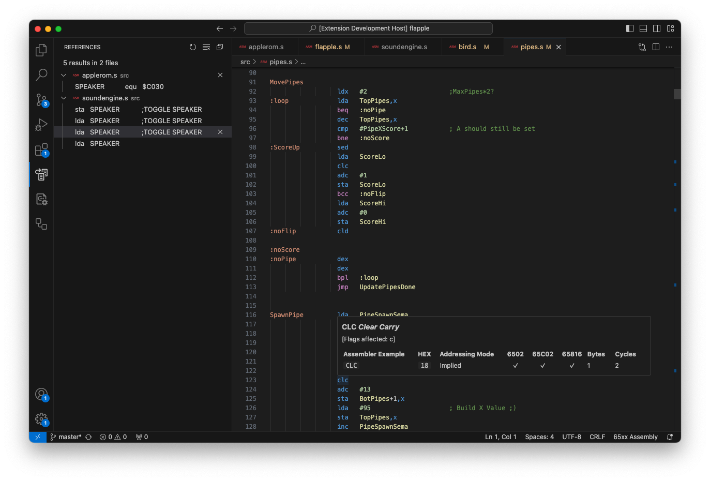

# Merlin32 VSCode Language Extension (65816 Assembly)

This provides syntax highlighting for Assembly Language written in the Merlin8/16+/32 format for 6502, 65C02, and 65816 CPUs.

## Features
- Source highlighting, indentation, formatting
- Handy opcode reference for all instructions.  Simply hover over an opcode to view details.
- Support for "Find All References", "Go To Declaration", "Rename Symbol", etc
- Workplace Symbols across your project.  Type `#` in the VSCode search bar to display them.

## Installation

Install extension from the [VS Marketplace](https://marketplace.visualstudio.com/items?itemName=dagenbrock.vscode-merlin-assembler).

Excellent Merlin32 documentation and the assembler downloads are available at https://brutaldeluxe.fr/products/crossdevtools/merlin/, thanks to Brutal Deluxe!

-----------------------------------------------------------------------------------------------------------

## Developer Notes

If you'd like to contribute, here are tips on getting started:

- fork/clone the source as normal
- make changes to the source files and save
- hit F5 to open an extension host running the highlighter to test your changes on some real source code
- commit, push, PR

Publishing notes at https://code.visualstudio.com/api/working-with-extensions/publishing-extension

## Release Notes

See [CHANGELOG.md](CHANGELOG.md) for list of releases and their detailed changes.